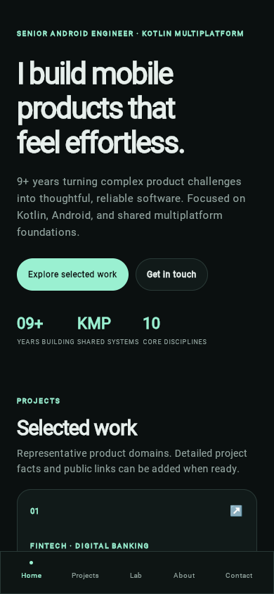
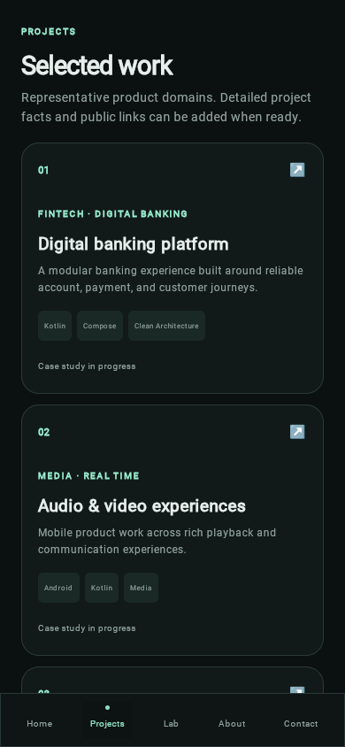
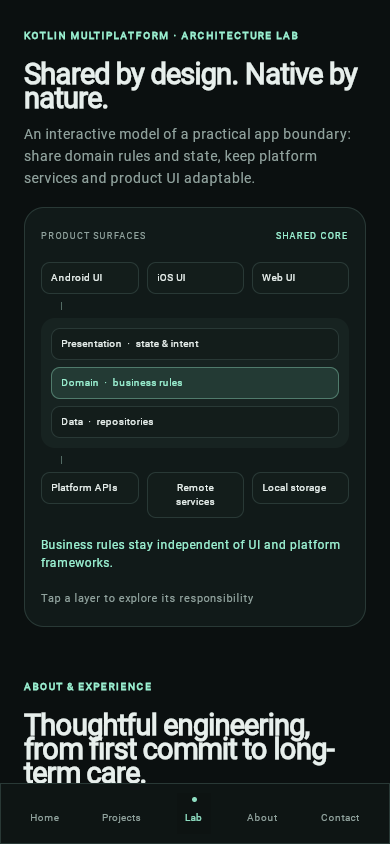
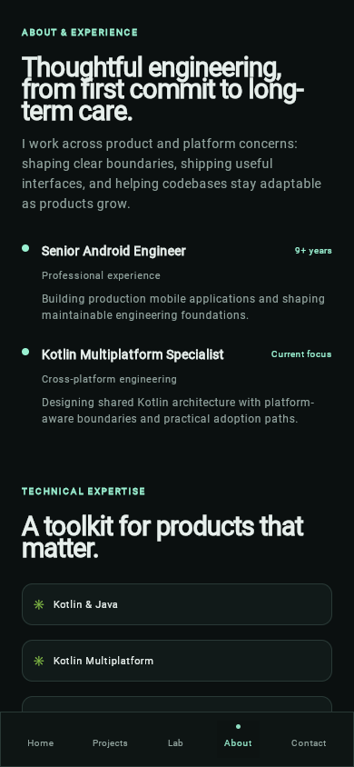
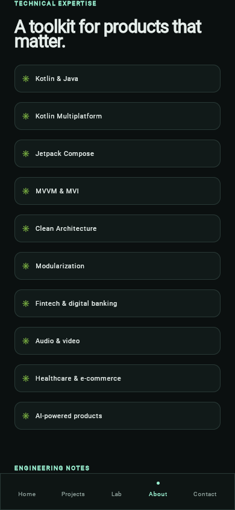
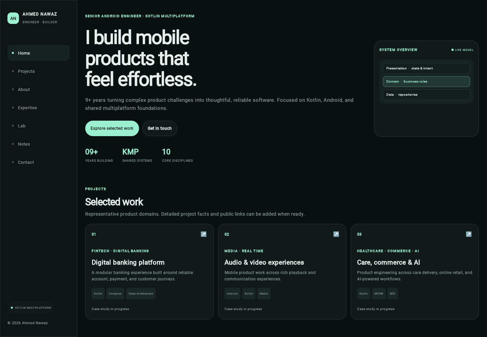
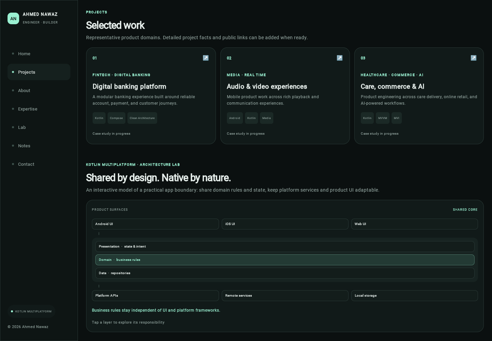
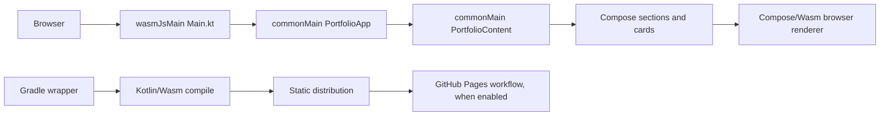

# Ahmed Nawaz — Engineering Portfolio

> **Current release status:** published on GitHub Pages at [ahmednawaz01.github.io/Ahmed-nawaz-portfolio-kmp](https://ahmednawaz01.github.io/Ahmed-nawaz-portfolio-kmp/). PR #1 was merged as `4b0b114`; the main-branch build, tests, artifact upload, and Pages deployment all succeeded on 2026-10-09 ([workflow run 37939856119](https://github.com/AhmedNawaz01/Ahmed-nawaz-portfolio-kmp/actions/runs/37939856119)). Local screenshots are labeled as local captures in the [screenshot index](docs/SCREENSHOTS.md). Project cards are domain-level placeholders, not substantiated client case studies.

## Contents

- [Overview and status](#overview-and-status)
- [Screenshots](#screenshots)
- [Technology and features](#technology-and-features)
- [Run, test, and build](#run-test-and-build)
- [Repository map](#repository-map)
- [Architecture and data flow](#architecture-and-data-flow)
- [Common changes](#common-changes)
- [Quality checks](#quality-checks)
- [Git workflow and contribution](#git-workflow-and-contribution)
- [CI and deployment](#ci-and-deployment)
- [Security and privacy](#security-and-privacy)
- [Troubleshooting](#troubleshooting)
- [Technical debt and roadmap](#technical-debt-and-roadmap)
- [More documentation](#more-documentation)

## Overview and status

A dark, mobile-first engineering portfolio for Ahmed Nawaz, Senior Android Engineer and Kotlin Multiplatform specialist with 9+ years of experience. It presents representative engineering domains, experience labels, technical expertise, an illustrative architecture lab, draft note topics, and contact/CV placeholders. No employer names, project outcomes, real contact details, or CV have been supplied, so none are invented.

There is one Gradle app module (`composeApp`) and no backend or database. The app is a responsive Compose Multiplatform web experience compiled to Kotlin/Wasm. Compose Multiplatform's Wasm target is Beta; see [architecture and platform notes](docs/ARCHITECTURE.md#platform-boundary).

**Repository:** [AhmedNawaz01/Ahmed-nawaz-portfolio-kmp](https://github.com/AhmedNawaz01/Ahmed-nawaz-portfolio-kmp). **Live site:** none verified yet.

## Screenshots

Genuine screenshots captured from the local production distribution on 2026-10-09 in Playwright Chromium 156.0.8078.4 (device scale factor 1). These are **local build** images, not a deployed production site. The actual UI has no detailed case-study screen, so none is shown as one.



*Home · 390×844 · local production build*



*Projects · 390×844 · local production build*



*Architecture Lab · 390×844 · local production build*



*About and experience · 390×844 · local production build*



*Technical expertise · 390×844 · local production build*



*Home · 1440×1000 · local production build*



*Projects · 1440×1000 · local production build*

## Technology and features

- Kotlin 2.4.20, Compose Multiplatform 1.12.1, Compose compiler plugin aligned to Kotlin, Material3 artifact 1.12.0-alpha03.
- Kotlin/Wasm (`wasmJs`) and a static webpack distribution.
- Gradle Kotlin DSL, version catalog, and Gradle 9.4.1 wrapper (Kotlin 2.4.20 fully supports Gradle through 9.7.0; see [compatibility table](https://kotlinlang.org/docs/gradle-configure-project.html#apply-the-plugin)).
- Shared UI/content in `commonMain`; browser entry point and HTML shell in `wasmJsMain`.
- Home, project listing, about/experience, expertise, engineering note titles, contact placeholders, responsive desktop rail/mobile bottom navigation, and an interactive conceptual architecture diagram.

Navigation is local Compose state that scrolls a single `LazyColumn`; this is not a multi-route site. Cards do not open detailed case studies. Contact/CV controls remain placeholders until verified details are provided. See [UI design system](docs/UI_DESIGN_SYSTEM.md) and [adding content](docs/ADDING_CONTENT.md).

## Run, test, and build

### Prerequisites

- JDK 17 or later (verification used JDK 17.0.20.1).
- Git. The wrapper downloads Gradle 9.4.1 on first run; no system Gradle is needed.
- A current browser with WebAssembly GC support for viewing the Wasm site. Local browser tests use ChromeHeadless.

### Commands (from repository root)

```sh
./gradlew :composeApp:wasmJsBrowserDevelopmentRun
```

Starts the hot-reloading development server. Gradle prints its local URL.

```sh
./gradlew :composeApp:wasmJsTest
```

Runs the Kotlin/Wasm browser tests. A successful run ends with `BUILD SUCCESSFUL` and reports discovered tests; a missing browser is a failure, not a pass.

```sh
./gradlew :composeApp:wasmJsBrowserDistribution
```

Builds the optimized static site. Verified output directory: `composeApp/build/dist/wasmJs/productionExecutable/` (`index.html`, `portfolio.js`, Wasm runtime files, and favicon).

Known local evidence: three content tests executed and the production build succeeded on 2026-10-09. The [testing guide](docs/TESTING.md) records exact commands and browser evidence.

## Repository map

```text
.
├── composeApp/                 Single multiplatform app module
│   └── src/
│       ├── commonMain/kotlin/   Shared portfolio content and Compose UI
│       ├── commonTest/kotlin/   Shared content integrity tests
│       └── wasmJsMain/          Web entry point, HTML shell, favicon
├── gradle/                     Wrapper and centralized dependency versions
├── .github/workflows/build.yml Build/test and conditional Pages deployment
├── docs/                       Architecture, setup, testing, design, release guides
├── gradlew                     Project-local Gradle 9.4.1 launcher
└── instruction.md              Repository execution specification
```

See [project structure](docs/PROJECT_STRUCTURE.md) for a detailed tree and file responsibilities.

## Architecture and data flow



`Main.main()` creates a `ComposeViewport` and calls `PortfolioApp()`. `PortfolioApp` owns the selected navigation label, list scroll state, and architecture-layer selection in local Compose state. It reads plain lists and data classes from `PortfolioContent.kt`; there is no network/API data flow. Detailed diagrams and boundaries are in [architecture](docs/ARCHITECTURE.md).

## Common changes

1. **Intro or profile wording:** edit the Home section in `composeApp/src/commonMain/kotlin/PortfolioApp.kt`; keep factual claims accurate.
2. **Projects, expertise, experience, note titles:** update the corresponding `PortfolioContent` lists in `composeApp/src/commonMain/kotlin/PortfolioContent.kt`. Example: add `Project("04", "Verified project title", "DOMAIN", "Approved summary", listOf("Kotlin"))` only after validating the claim.
3. **Case study:** no detailed case-study screen exists. Do not turn a placeholder into a claimed case study. First gather approved problem, role, design decisions, trade-offs, outcomes, links, and media; then extend the model/UI and navigation, with tests.
4. **Contact or CV:** add only owner-approved public addresses and an actual CV PDF. Keep paths relative for project pages; verify the files in the output directory.
5. **Color or typography:** adjust private tokens at the top of `PortfolioApp.kt`; font links and fallback are in `wasmJsMain/resources/index.html`.
6. **Navigation destination:** update `destinations`, `destinationIndex`, the navigation bars, and the matching ordered `LazyColumn` item together. Test mobile and desktop scroll mapping.
7. **Reusable UI:** extract a small `@Composable` in `PortfolioApp.kt` when a repeated visual pattern benefits from one implementation.

Step-by-step guidance: [adding content](docs/ADDING_CONTENT.md), [design system](docs/UI_DESIGN_SYSTEM.md), and [contributing](CONTRIBUTING.md).

## Quality checks

- **Executed:** `./gradlew :composeApp:wasmJsBrowserDistribution` — `BUILD SUCCESSFUL`; see [build evidence](docs/DEVELOPMENT.md).
- **Tests:** `./gradlew :composeApp:wasmJsTest` — `BUILD SUCCESSFUL`; three content assertions executed in ChromeHeadless.
- **Docs:** local Markdown paths and screenshot references were checked; `git diff --check` is run before commit.
- **Visual QA:** genuine saved captures were inspected at 390 and 1440 CSS px; a 320 px browser smoke check showed no horizontal overflow. No detailed case-study screen exists.

## Git workflow and contribution

Use a short feature branch, make a focused change, run relevant checks, inspect `git diff`, and open a pull request to `main`. Do not commit credentials, client data, generated build output, or unapproved portfolio claims. Follow [CONTRIBUTING.md](CONTRIBUTING.md). CI runs from the committed Gradle wrapper.

## CI and deployment

`.github/workflows/build.yml` runs tests and the production distribution for `main`, `feature/**`, pull requests, and manual dispatch. It uploads `composeApp/build/dist/wasmJs/productionExecutable` and deploys only on `main`. GitHub Pages is configured for Actions; the latest main workflow deployed commit `4b0b114` successfully. See [deployment](docs/DEPLOYMENT.md).

## Security and privacy

The static app has no backend, credentials, persistence, analytics, or custom external API. The HTML shell requests Google Fonts at runtime and must fall back to system fonts if unavailable. Keep secrets and confidential employer/client/customer data out of source, screenshots, and public case studies. The GitHub workflow requires only repository read for build; Pages write and OIDC are scoped to the deploy job.

## Troubleshooting

| Symptom | Likely cause | Check/fix |
| --- | --- | --- |
| Wrapper cannot download Gradle | Network/proxy restriction | Check `./gradlew --version` and approved network access; no global Gradle install is required. |
| Kotlin daemon runs out of memory | Wasm optimizer needs heap | `gradle.properties` sets 3 GB; ensure the machine can provide it. |
| `wasmJsTest` cannot launch ChromeHeadless | Browser missing or undiscoverable | Install a compatible browser in an approved way or set `CHROME_BIN`; see [testing](docs/TESTING.md). |
| Blank page on older browser | Wasm GC unsupported or JS/Wasm assets fail | Use a current supported browser and inspect network/console; serve the complete distribution directory. |
| Project Pages subpath fails | Host omitted one or more output files | Upload the contents of `productionExecutable` and retain relative names. |
| Pages action cannot configure site | Pages not enabled/source mismatch/permissions | Set repository Pages source to GitHub Actions and inspect the deploy job permissions. |

## Technical debt and roadmap

Highest priority: publish reviewed case studies/contact/CV and verify the Pages deployment. Next: add navigation/UI regression checks, accessibility review, and target-device performance measurements. The full evidence-based register with effort estimates and verification criteria is [here](docs/TECHNICAL_DEBT.md).

## More documentation

- [Architecture](docs/ARCHITECTURE.md) · [Project structure](docs/PROJECT_STRUCTURE.md) · [Design system](docs/UI_DESIGN_SYSTEM.md)
- [Development](docs/DEVELOPMENT.md) · [Testing](docs/TESTING.md) · [Deployment](docs/DEPLOYMENT.md)
- [Adding content](docs/ADDING_CONTENT.md) · [Screenshots](docs/SCREENSHOTS.md) · [Technical debt](docs/TECHNICAL_DEBT.md)
- [Changelog](docs/CHANGELOG.md) · [Contribution guide](CONTRIBUTING.md)
