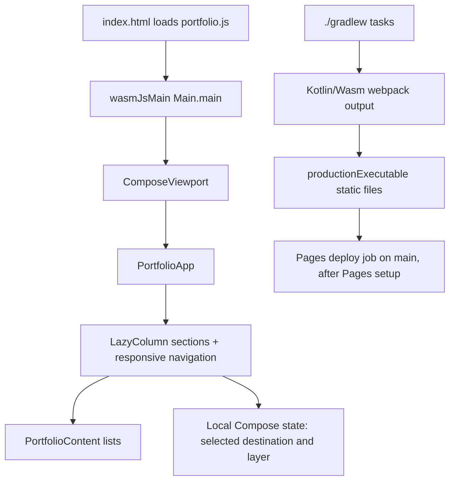

# Application architecture

## At a glance

The repository contains one Kotlin Multiplatform module, `composeApp`, with a Kotlin/Wasm browser target. `commonMain` shares UI and portfolio content; `wasmJsMain` supplies the browser entry point and static HTML assets. There are no invented domain/data modules: for this static portfolio, simple data classes and local state are sufficient.

```text
Browser
└── wasmJsMain
    ├── Main.kt                 Calls ComposeViewport { PortfolioApp() }
    └── resources               index.html and favicon.svg
        ↓ calls
commonMain
├── PortfolioApp.kt             Layout, navigation, reusable UI and color tokens
└── PortfolioContent.kt         Projects, experience, expertise and notes
```



## Build configuration

- `settings.gradle.kts` defines plugin and dependency repositories and includes `:composeApp`.
- Root `build.gradle.kts` declares plugin aliases and shared Maven repositories.
- `gradle/libs.versions.toml` keeps Kotlin, Compose, and Material3 versions in one place.
- `composeApp/build.gradle.kts` configures `wasmJs`, its browser distribution, and the Compose dependencies.
- `gradle.properties` gives the Kotlin compiler daemon enough heap for production Wasm optimization.

The app does not have Android, iOS, desktop, or server targets yet. Adding one should be a deliberate product decision: it changes build configuration, source-set ownership, and platform testing needs.

## UI organization

`PortfolioApp.kt` owns the presentation layer:

- `PortfolioApp` chooses a desktop side rail or mobile bottom bar based on available width and holds the active section state.
- Section composables group the Home, Projects, Architecture Lab, About, Expertise, Notes, and Contact content.
- Small composables such as `Eyebrow`, `Pill`, `TinyTag`, and `LayerChip` keep repeated visual patterns consistent.
- The architecture diagram is an interactive teaching model. Selecting Presentation, Domain, or Data changes the explanatory text.
- Color values are private file-level tokens near the top of the file.

The current navigation scrolls to entries in one `LazyColumn`. Its item order and `destinationIndex` mapping must stay aligned when adding or reordering sections.

## Startup, navigation, and state

1. `index.html` sets the document metadata and loads `portfolio.js` from the same directory.
2. `wasmJsMain/kotlin/Main.kt` calls `ComposeViewport { PortfolioApp() }`.
3. `PortfolioApp` initializes `selected`, `entered`, and a `LazyListState`. It chooses a 228 dp desktop rail at widths of 920 dp and above; smaller widths get a bottom navigation bar.
4. Clicking a navigation item changes the selected label and animates the single list to the index returned by `destinationIndex`. The ordered list items currently map Home, Projects, Lab, About, Expertise, Notes, and Contact. The bottom bar displays a subset of destinations.
5. Each section reads `PortfolioContent` values. The architecture diagram separately holds its selected layer in `remember` state and updates its explanatory text.

There is no route/deep-link state, API call, repository, persistence, or view model. The whole experience is one canvas-based Compose viewport. If route-level pages or remote content are introduced, update this architecture and add focused state/data boundaries rather than creating unused abstractions.

## Module responsibility and dependency direction

| Source set / module | Responsibility | Depends on / used by | Test and change boundary |
| --- | --- | --- | --- |
| `:composeApp` | The only Gradle module; configures `wasmJs` and Compose dependencies. | Kotlin/Compose plugins and catalog; workflow builds its distribution. | Gradle configuration and Wasm tasks. Do not add platform modules without a real target. |
| `composeApp/src/commonMain` | `PortfolioContent.kt` data models/lists and `PortfolioApp.kt` UI, navigation, and local UI state. | Compose runtime/UI/material/foundation/animation; called by web entry point. | Content integrity in `commonTest`; add more tests when state/model logic is extracted. Keep browser APIs out of shared code. |
| `composeApp/src/commonTest` | Platform-neutral tests for shared content invariants. | `kotlin.test`; target runner is configured through the Wasm browser test task. | Assertions are meaningful only when the browser runner discovers and executes tests. |
| `composeApp/src/wasmJsMain` | `Main.kt`, HTML shell, favicon, browser viewport. | Shared `PortfolioApp`; browser platform APIs. | Production distribution and browser/manual smoke test. Do not put portfolio copy here. |

Dependency direction is web entry point → shared UI → shared content values. Build configuration compiles and packages the graph; runtime has no service layer.

## Platform boundary

The repository ships only a Wasm web target. The diagram's Android, iOS, and web boxes are a **conceptual architecture example**, not implemented or shipped platform targets. Compose Multiplatform's Wasm target is Beta and requires a browser with WebAssembly GC support. The artifact is a static JS/Wasm bundle; the Wasm runtime adds startup and download cost, which must be assessed on actual target devices.

## Test, build, and deploy flow

`./gradlew :composeApp:wasmJsTest` compiles and executes common tests using the configured browser runner. `./gradlew :composeApp:wasmJsBrowserDistribution` writes the production site to `composeApp/build/dist/wasmJs/productionExecutable/`. GitHub Actions uploads that exact directory; only the `main` workflow path attempts Pages deployment, with `pages: write` and `id-token: write` scoped to the deploy job. See [testing](TESTING.md) and [deployment](DEPLOYMENT.md).

## Content boundary

`PortfolioContent.kt` holds plain Kotlin data models and lists. It deliberately avoids project-specific client names, dates, results, metrics, and external links that Ahmed has not supplied. Replace generic summaries with reviewed facts before publishing a case study.

Some contact and CV placeholder copy remains in `PortfolioApp.kt` because it is presentation guidance. Before adding real contact links or a CV, move those values into the content layer and add the approved static file under `composeApp/src/wasmJsMain/resources`.

## Runtime and data flow

The app is entirely static. It has no backend calls, persistence, analytics, or authentication. Compose creates the viewport, reads local content objects, and renders the responsive sections. Navigation and the architecture lab use local Compose state.

## Web platform considerations

Compose Multiplatform's Wasm web target is Beta. Users need a browser with WasmGC support. The current build emits a JS bundle and Wasm assets; the production output also includes Skiko runtime Wasm files. The verified build reports size warnings, so measure on actual devices before adding heavier dependencies.

Sources: [Compose Multiplatform compatibility](https://kotlinlang.org/docs/multiplatform/compose-compatibility-and-versioning.html), [Kotlin/Wasm overview](https://kotlinlang.org/docs/wasm-overview.html).
