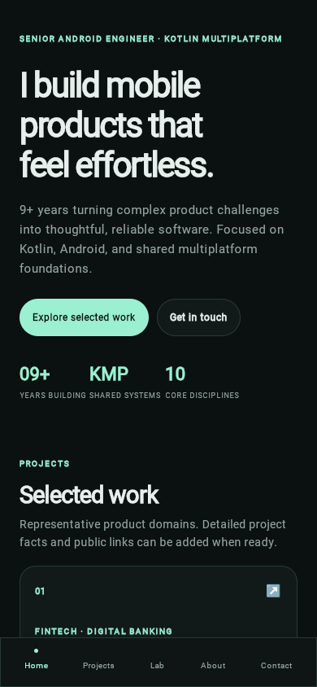

# Screenshot capture

## Current status

Screenshots below are unmodified captures of the local production distribution, served from `composeApp/build/dist/wasmJs/productionExecutable/` and rendered in Playwright Chromium 156.0.8078.4 on 2026-10-09. Viewports use CSS pixels at device scale factor 1. The app loaded with HTTP 200 for HTML, JS, Wasm, and favicon assets; Playwright recorded no page errors or failed requests during the final capture run. The app is now deployed to [GitHub Pages](https://ahmednawaz01.github.io/Ahmed-nawaz-portfolio-kmp/) (HTTP 200 verified), but the images below remain local-build screenshots; no production-host screenshots are claimed.

| Screenshot | Caption | Viewport/source |
| --- | --- | --- |
|  | Home and selected work, mobile | 390×844, local production build |
|  | Projects, mobile | 390×844, local production build |
|  | Architecture Lab, mobile | 390×844, local production build |
|  | About and experience, mobile | 390×844, local production build |
|  | Technical expertise, mobile | 390×844, local production build |
|  | Home, desktop | 1440×1000, local production build |
|  | Projects, desktop | 1440×1000, local production build |
|  | Home, mobile | 390×844, production GitHub Pages URL, 2026-10-09 |

No detailed case-study screen exists, so there is no case-study screenshot. The first seven images are local-build evidence. The final image was captured from the live Pages URL after deployment; Playwright confirmed no page errors or failed requests, and the document width matched the 390 px viewport. `docs/TECHNICAL_DEBT.md` tracks the content gap and Gradle wrapper update.

See the [screenshot index](screenshots/README.md) for the current image inventory. The initial Safari automation attempt was blocked by disabled remote automation and the environment had no capturable desktop display; project-local temporary Playwright/Chromium later enabled genuine headless captures without changing Safari settings or installing software system-wide.

## Capture after browser automation is permitted

1. Build the production distribution using [the development instructions](DEVELOPMENT.md).
2. Serve `composeApp/build/dist/wasmJs/productionExecutable` on localhost.
3. Open it in a supported browser and wait until Compose has rendered all required JS/Wasm assets.
4. Capture the actual screens that exist at mobile and desktop sizes. Do not label the project cards as a detailed case study.
5. Save unmodified captures under `docs/assets/screenshots/` with descriptive names.
6. Record browser version, viewport dimensions, date, and local/production source. Inspect the files for clipping, overflow, missing assets, and unreadable text.

Screenshots should show the running app, not a design mockup or a locally altered image.
